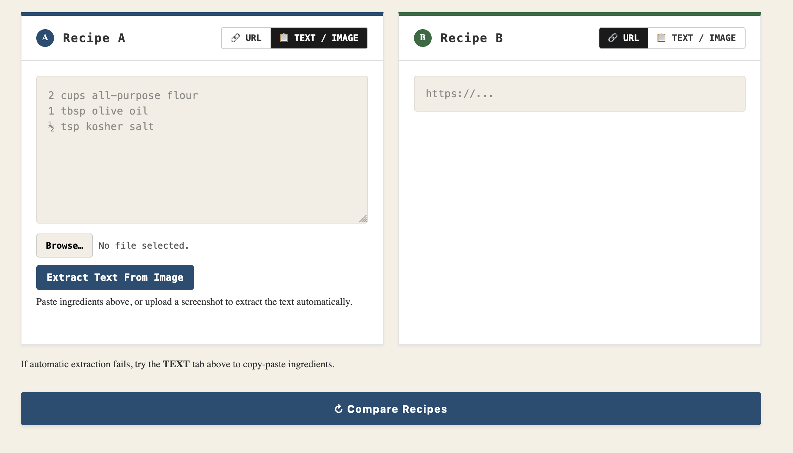
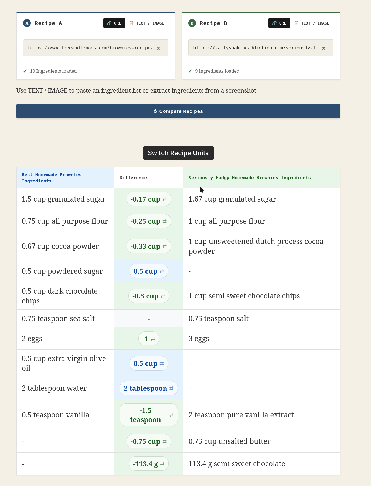
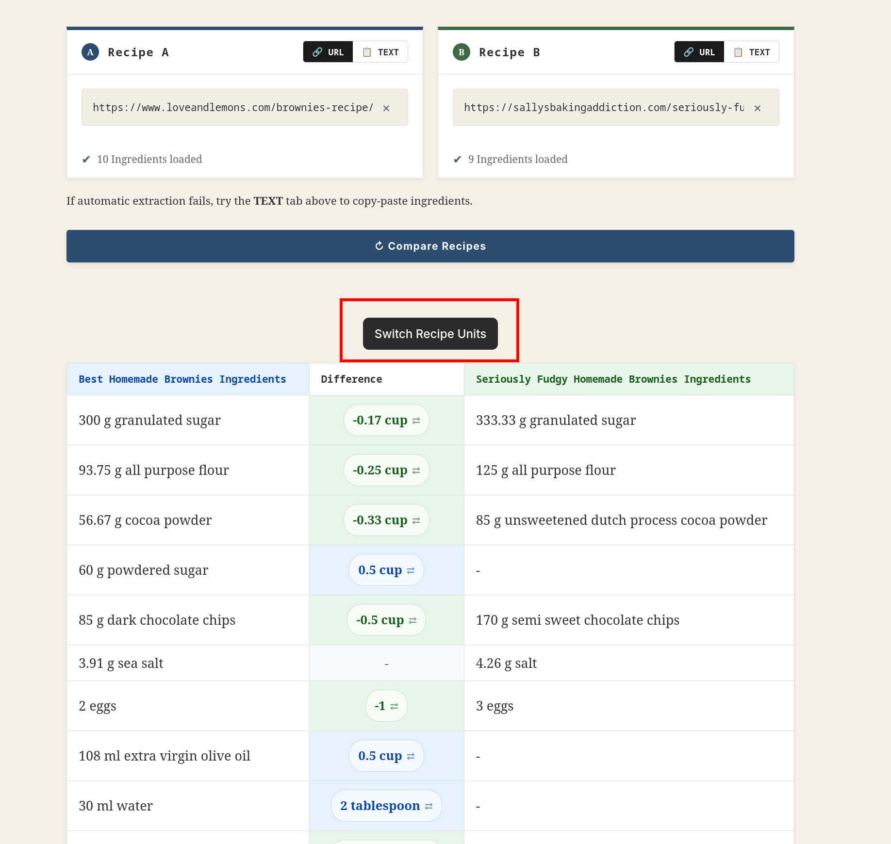
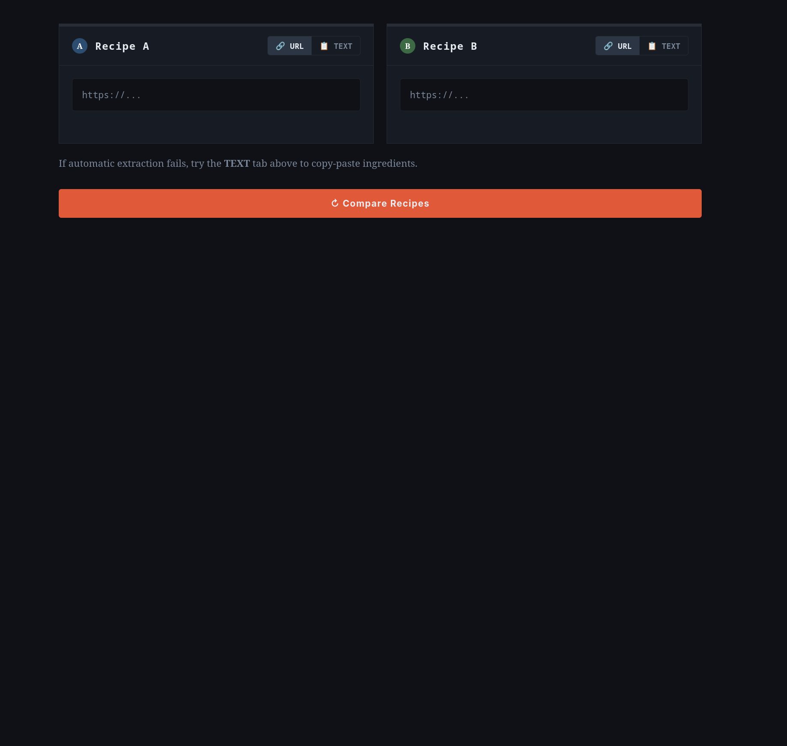
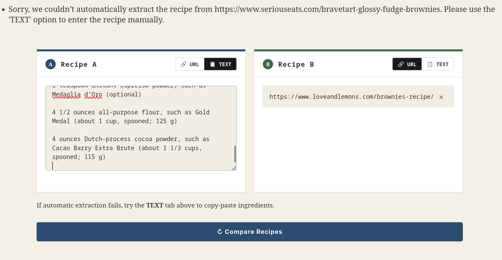
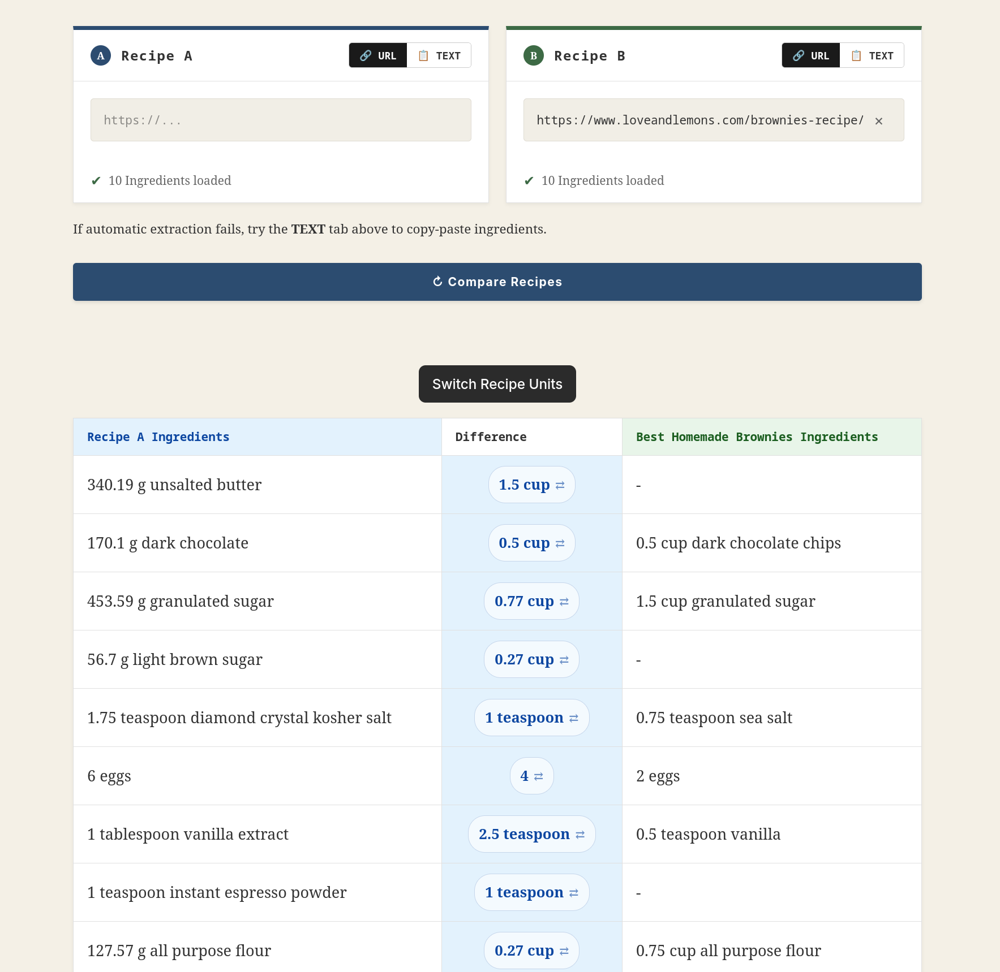
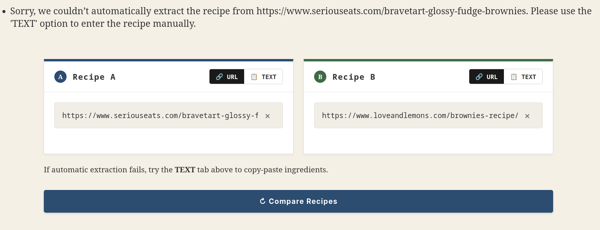
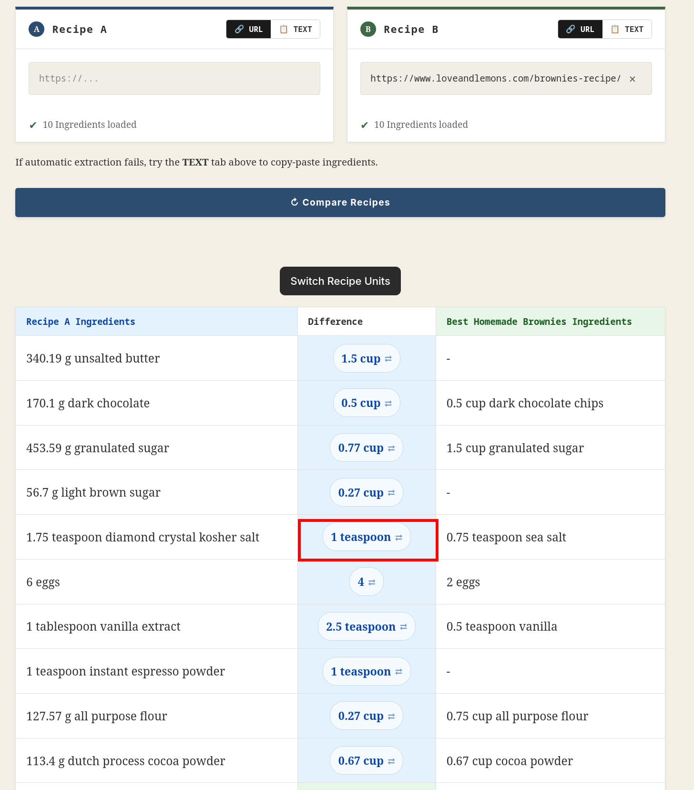

# RecipeTools

[](https://github.com/AbrasiveSquid/recipe-comparison-tool/actions/workflows/recipe-tools-AutoDeployTrigger-304534ce-8018-48e0-bded-65e8b0437a4b.yml)

Compare two recipes side by side to identify differences in ingredients, quantities and measurements.

**[Try the live application](https://recipetools.app)**

## What it does

RecipeTools accepts two recipes as URLs or pasted ingredient lists, normalizes their measurements and pairs equivalent ingredients for comparison.

- **Ingredient parsing:** Handles fractions, decimals, common volume and mass units, and unusual recipe quantities.
- **Density-aware conversion:** Converts solid ingredients to grams and liquids to millilitres using an embedded density table.
- **Similarity matching:** Normalizes ingredient names and uses keyword similarity to pair related ingredients.
- **Flexible units:** Switch all ingredients or individual ingredients between metric and kitchen units.
- **No application accounts or stored recipe data:** Comparisons are processed without persistent storage.

##  Code Highlights

- Matches normalized ingredient keywords using a Jaccard similarity score and greedy one-to-one pairing.
- Protects server-side URL fetching against SSRF by restricting schemes and ports, rejecting credentials and non-public IP addresses, resolving hostnames before requests, and validating every redirect.
- Uses multiple recipe-extraction strategies while applying the same URL and redirect protections to each network client.
- Runs 25 automated tests with 10 URL-validation tests, followed by an application startup check before deployment.
- Builds and deploys a Docker image through GitHub Actions to Azure Container.

## Demo

Open **[recipetools.app](https://recipetools.app)** and compare these two brownie recipes:

- [Love and Lemons brownies](https://www.loveandlemons.com/brownies-recipe/)
- [Sally's Baking Addiction fudgy brownies](https://sallysbakingaddiction.com/seriously-fudgy-homemade-brownies/)

## Screenshots

### Recipe input

<kbd></kbd>

### Ingredient comparison

<kbd></kbd>

### Switching measurement systems

<kbd></kbd>

<details>
<summary><strong>More screenshots</strong></summary>

### Dark mode

<kbd></kbd>

### Manual text input

<kbd></kbd>

### Text comparison

<kbd></kbd>

### URL extraction error

<kbd></kbd>

### Switching one ingredient

Before:

<kbd></kbd>

After:

<kbd></kbd>

</details>

## How it works

1. **Input:** The user supplies two recipe URLs, two ingredient lists, or one of each.
2. **Validation and extraction:** Public HTTP or HTTPS URLs are validated and recipe data is extracted from the returned HTML.
3. **Parsing:** Each ingredient line is parsed into an `Ingredient` object containing its name, amount and measurement.
4. **Normalization:** Names are lowercased and cleaned, selected adjectives are removed, plurals are singularized, and units are normalized.
5. **Enrichment:** Ingredient density and physical state are assigned so kitchen and metric measurements can be converted.
6. **Matching:** Candidate pairs receive a Jaccard similarity score and are greedily paired from highest to lowest score.
7. **Comparison:** Quantity differences are calculated and displayed to the user.

### Similarity calculation

For keyword sets $A$ and $B$, the similarity score $S$ is:

$$
S(A,B) = \frac{|A \cap B|}{|A \cup B|}
$$

Unmatched ingredients are paired with an empty clone so their full quantity appears as the difference.

## Architecture

| Component | Responsibility |
| --- | --- |
| `Ingredient` | Stores an ingredient's normalized name, amount and measurement; performs conversions and difference calculations. |
| `Recipe` | Holds a collection of ingredients and performs one-to-one similarity matching between recipes. |
| `RecipeComparator` | Validates input, creates `Recipe` objects and exposes the completed comparison. |
| `recipe_scraper.py` | Validates public URLs, follows safe redirects and extracts structured recipe data using bounded network requests. |
| Flask application | Handles requests and renders the input and comparison views with Jinja2. |

## Tech stack

| Area | Technologies |
| --- | --- |
| Backend | Python 3.13, Flask, Jinja2, Gunicorn |
| Parsing and language processing | ingredient-parser, NLTK, inflect |
| Frontend | Vanilla JavaScript, HTML, CSS |
| Testing | pytest, unittest |
| Packaging | Docker, GHCR |
| CI/CD and hosting | GitHub Actions, Azure OIDC, Azure Container Apps |

## Running locally

### Requirements

- Python 3.13
- Git

### Setup

1. Clone the repository:

```bash
git clone https://github.com/AbrasiveSquid/recipe-comparison-tool.git
cd recipe-comparison-tool
```

2. Create and activate a virtual environment:

```bash
python -m venv .venv
source .venv/bin/activate
```

3. Install the dependencies:

```bash
python -m pip install -r requirements.txt
```

4. Set a local-only Flask secret and start the development server:

```bash
export SECRET_KEY=local-development-only
flask --app recipe_comparison run --debug
```

The bundled `nltk_data/` directory contains the language data used by the application.

## Testing

Run the complete test suite:

```bash
SECRET_KEY=test-only-key python -m pytest -q
```

Verify that the complete Flask application can start with its required configuration:

```bash
SECRET_KEY=test-only-key python -c 'from recipe_comparison import app; print("Application import passed")'
```

On every push to `main`, GitHub Actions runs both checks before allowing the Azure deployment job to begin.

## Deployment

The application is packaged as a Docker image and published to GHCR. GitHub Actions authenticates to Azure, deploys the image to Azure Container Apps and injects the Flask secret from the Container Apps secret store. Production secrets are not committed to the repository or embedded in the image.

## Limitations

- **Scraper reliability:** Some websites block automated requests or do not expose usable structured recipe data. Manual text input is available as a fallback.
- **Density coverage:** Ingredients absent from the density table use a default conversion value (water density).
- **Parser accuracy:** Unusual ingredient formatting can be interpreted incorrectly.
- **Greedy matching:** Ingredient pairing selects the highest available similarity score rather than calculating a globally optimal assignment.
- **Rounding:** Kitchen measurements are limited to a denominator of 48, so extremely small differences may be rounded away.

## Contributing

Issues and pull requests are welcome, particularly for:

- Edge-case ingredient formats
- Density-table additions
- Keyword normalization and matching improvements
- Recipe extraction compatibility

## License

This project is available under the MIT License.
